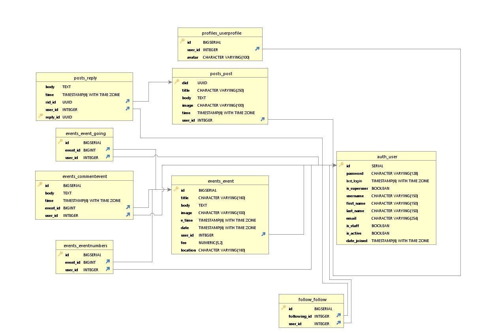

# IKONIC EVENTS

## Table of Contents
* [Introduction](#Introduction)
* [Features](#Features)
* [Wireframes](#Wireframes)
* [Database Design](#Database-Design)
* [Technologies](#Technologies)
* [Testing](#Testing)
* [Deployment](#Deployment)
    * [Project Creation](#Project-Creation)
    * [Heroku Deployment](#Deployment-To-Heroku)
    * [Run Locally](#Run-Locally)
    * [Fork Project](#Fork-Project)
* [Credits](#Credits)
  * [Acknowledgements](#Acknowledgements)

## Introduction

Welcome to DBAA

This project was created for the Code Institute Pride hackathon. It is a social networking and events platform for LGBTQ+ users to advertise events and connect with other users.

## Features

**Home Page**

The home page contains: 
- Hero Image
- An introduction to the website for users to understand what the website is about. 
- A featured event - This will show the most popular event
- The next six upcoming events so users can see the next events scheduled by closest to current date
This page is not visible when logged in.

**Event List Page**

This page has a list of all upcoming events that are greater than today, it displays the following information:
- Title
- Created by (username & date time)
- Thumbnail image

This page will allow users to browse a full list of events ordered by date.

**Event Detail Page**

This page is a detailed event display page that will show the user all of the information for the chosen event.

Information Displayed:
- Event Title
- Event organiser and date / time posted
- Event Decription
- Date
- Time
- Location
- Price

The page also displays comments from users on the event as well as a form to leave a comment which is hidden and displayed on button click. This will allow users to discuss the event with others.

A thumbs up icon will be displayed to allow the user to mark themselves as going and if they have marked going already, a thumbs down to mark not going.

A total count will be available of all users marked going. This will allow the users to get a rough idea of how big the events may be.

Icons are displayed to edit and delete the event to the users who own them. These will take you to the edit post or delete post pages and allow users full management of their own events.

**Discusions List Page**

This page has a list of all created posts in order of newest posted, it displays the following information:
- Title
- Created by (username & date time)
- Thumbnail image

This page will allow users to browse a full list of posts and can click in to ones that interest them to see the full details. 
If you click the username of the poster from the list, it will link you to their profile page.

**Discussion Detail Page**

This page will show more detailed information on the discussion. Information shown:

- Title
- Post contents
- Date and time posted
- Edit and delete buttons for the author
- Comments on the post
- Edit and delete buttons on comments

This will allow the author to have full control over the post and commenters control on their comments. Clicking the edit or delete buttons will take you to the respective edit and delete pages.

There will also be a reply button that hides and shows the comment form to allow users to comment on the post.

**User Profile Page**

The user profile page is displayed differently for users viewing their own profile and viewing a profile of another user.

Features when viewing own profile:

- Avatar
- Edit Avatar button that loads the edit avatar form in the second card to allow users to update their avatar
- Username
- Friends Button - This displays a list of all users you are following in the second card
- Events Button - This displays a list of all events you marked as going to in the second card
- Personal Details - Displays your personal details in the second card
- Edit Details Button - Edit details form will be displayed in the second card to allow users to update their details

Features when viewing another users profile:

- Avatar
- Follow Button that can be used to follow or unfollow users
- Events Button - Displays a list of events the user has marked going to in the second card
- Friends Button - Displays all users the user is following on the second card

## Wireframes

## Database Design

## Technologies
* [HTML](https://en.wikipedia.org/wiki/HTML)
	* This project uses HTML as the main language used to complete the structure of the Website.
* [CSS](https://en.wikipedia.org/wiki/CSS)
	* This project uses custom written CSS to style the Website.
* [JavaScript](https://en.wikipedia.org/wiki/JavaScript)
    * JS was used to load the toasts and to create the Stripe payments. It was also used for the refresh/scroll functionalty on the chatrooms.
* [Python](https://www.python.org/) 
    * This project was created using Python framework [Django](https://www.djangoproject.com/) following Model-View-Template design and 
* [Django](https://www.djangoproject.com/)
    * Python framework the application was built on
* [CLOUNDINARY](https://cloudinary.com/)
    * Cloudinary storage was used to user uploaded images

## Testing

## Known Bugs

Validation fails on pages that CK editor is used for the rich text formatting, it is coming from the rendered html code within which we have no control over.

### Test Results

## Deployment

### Project Creation
To create this project I used the `git init` command in the terminal from VS Code.

I then used the `git add .` command followed by `git commit -m "Initial commit"` and was then prompted to create a new repository 
with the choices of public or private.

The following commands were used for version control throughout the project:

`git add <filename>` - This command was used to add files to the staging area before committing.

`git commit -m "commit message explaining the updates"` - This command was used to to commit changes to the local repository.

`git push` - This command is used to push all committed changes to the GitHub repository.

### Deployment to Heroku

**Create application:**
1. Navigate to Heroku.com and login.
1. Click on the new button.
1. Select create new app.
1. Enter the app name.
1. Select region.

**Set up connection to Github Repository:**

1. Click the deploy tab and select GitHub - Connect to GitHub.
1. A prompt to find a github repository to connect to will then be displayed.
1. Enter the repository name for the project and click search.
1. Once the repo has been found, click the connect button.

**Add PostgreSQL Database:**

1. Click the resources tab.
1. Under Add-ons seach for Heroku Postgres and then click on it when it appears.
1. Select Plan name Hobby Dev - Free and then click Submit Order Form.

**Set environment variables:**

1. Click on the settings tab and then click reveal config vars.
1. Variables added: 
    * DATABASE_URL
    * EMAIL_HOST_PASS
    * EMAIL_HOST_USER
    * SECRET_KEY
    * CLOUNDINARY_URL

**Enable automatic deployment:**
1. Click the Deploy tab
1. In the Automatic deploys section, choose the branch you want to deploy from then click Enable Automation Deploys.

### Run Locally

1. Navigate to the GitHub [Repository](https://github.com/Daisy-McG/IKONIC-EVENTS).
1. Click the Code drop down menu.
1. Either Download the ZIP file, unpackage locally and open with IDE (This route ends here) OR Copy Git URL from the HTTPS dialogue box.
1. Open your developement editor of choice and open a terminal window in a directory of your choice.
1. Use the `git clone` command in terminal followed by the copied git URL.
1. A clone of the project will be created locally on your machine.

Once the project has been loaded into an IDE of choice, run the following command in the shell to install all the required packages:
`pip install -r requirements.txt`

### Fork Project 

Most commonly, forks are used to either propose changes to someone else's project or to use someone else's project as a starting point 
for your own idea. - Definition from [Github Docs](https://docs.github.com/en/free-pro-team@latest/github/getting-started-with-github/fork-a-repo).

1. Navigate to the GitHub Repository you want to fork.
1. On the top right of the page under the header, click the fork button.
1. This will create a duplicate of the full project in your GitHub Repository.

****
## Credits

### Acknowledgements

Developers:
* [Tanya](https://github.com/datonex)
* [Alaa](https://github.com/Hijazi-alaa)
* [Matt](https://github.com/Matthew-Hurrell)
* [Daisy](https://github.com/Daisy-McG)

Facillitator:
* [Jim](https://github.com/JimLynx)